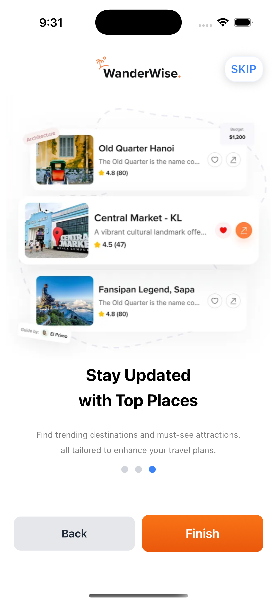
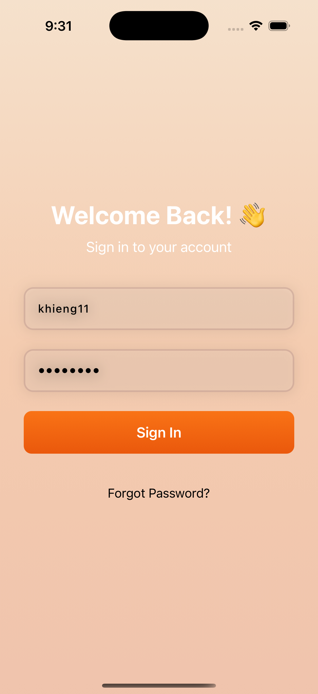
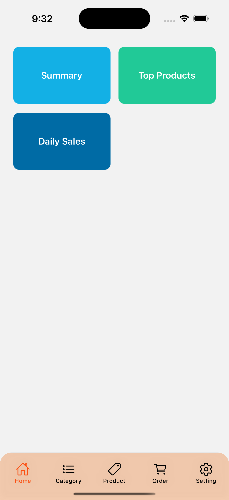
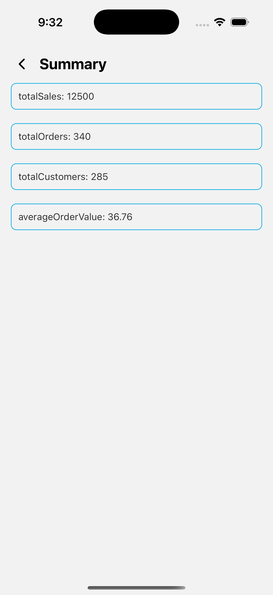
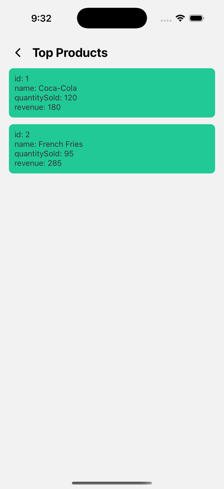
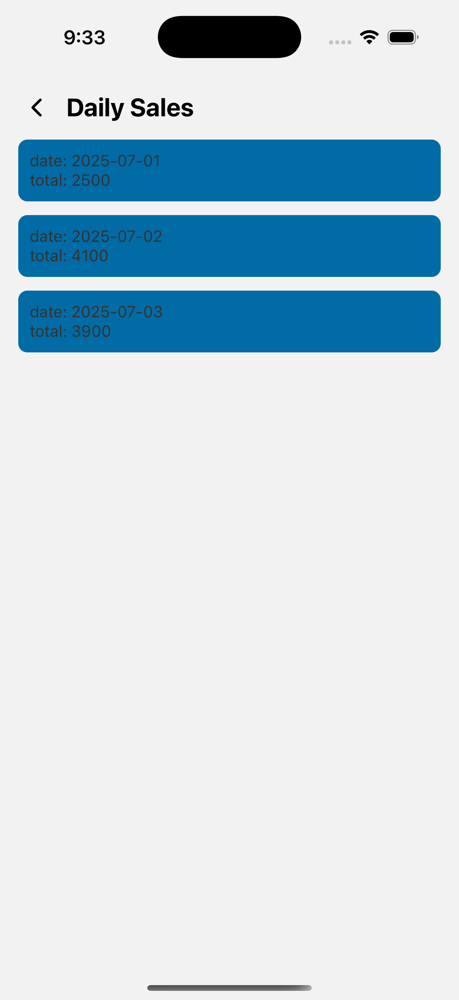
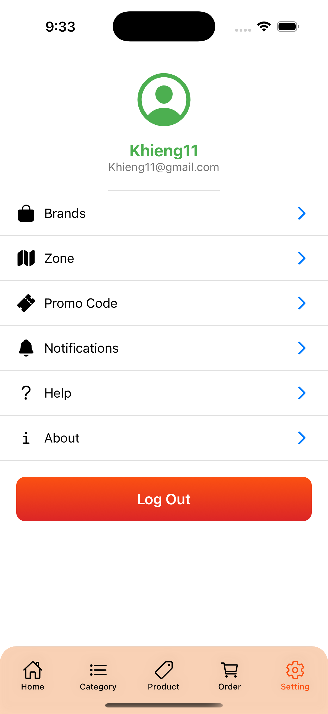

# 📱 React Native CLI Quick Guide

A handy guide for getting started and managing your React Native projects using the CLI.

---

## ✅ BACK-END API

```powershell
API_URL = 'https://khieng.online/api';

# swagger 
https://khieng.online/api/swagger-ui/index.html#/

# Login user on swagger
username: khieng11
password: password

```

---

## ✅ Check React Native CLI Version

```powershell
npx react-native --version
```

---

## ✅ Create a New Project

```powershell
npx @react-native-community/cli init MyLearning
```

---

## ✅ Run the App

```powershell
cd MyLearning
npx react-native run-ios      # For iOS (macOS only)
npx react-native run-android  # For Android

# Using npm
npm run android
npm run ios
```

---

## ✅ Doctor - Diagnose Your Environment

```powershell
npx react-native doctor
```

---

## ✅ Update and Reinstall CocoaPods (iOS)

```powershell
cd ios
pod install --repo-update
cd ..
```

---

## ✅ Use a Different Port (if 8081 is in use)

```powershell
npx react-native run-ios --port=8088
```

---

## ✅ Restart Metro Bundler (Clear Cache)

```powershell
npx react-native start --reset-cache
```

---

## ✅ Basic & Useful CLI Commands

```powershell
react-native init MyApp               # Create a new project
npx react-native run-android          # Build & run on Android
npx react-native run-ios              # Build & run on iOS
npx react-native start                # Launch Metro bundler
npx react-native bundle               # Generate production JS bundle
react-native link                     # Link native dependencies
react-native upgrade                  # Upgrade React Native version
react-native info                     # Show environment info
react-native doctor                   # Diagnose setup issues
```

---

## ✅ All dependencies 

```powershell
# Install all required dependencies
npm install react-native-linear-gradient   # Creates smooth color gradients for UI elements
npm install @react-navigation/native-stack # Stack navigator for screen transitions
npm install @react-navigation/native       # Core library for React Navigation
npm install @react-navigation/bottom-tabs  # Bottom tab navigator for tab-based navigation
npm install react-native-screens           # Optimizes screen rendering for navigation
npm install react-native-safe-area-context # Handles safe area insets for notched devices
npm install react-native-vector-icons      # Provides customizable icon sets for UI
npm install react-native-gesture-handler   # Enables gesture-based interactions
npm install react-native-reanimated        # Supports advanced animations and transitions

# For iOS: Install CocoaPods dependencies
npx pod-install
```

---

### TypeScript Setup
```powershell
npm install --save-dev typescript @types/react @types/react-native
```

---

## ✅ Clean Build Android

```powershell
# Clean the npm
npm cache clean --force

# Clean the Gradle build cache (for Android)
cd android
./gradlew clean
cd ..

# Remove the node_modules folder and package-lock.json (optional, if needed)
rm -rf node_modules package-lock.json
# Reinstall dependencies
npm install

# Clean the Metro bundler cache
npx react-native start --reset-cache

```

---

## ✅ Clean Build iOS

```powershell
# Navigate to the iOS folder
cd ios

# Clean the Xcode build
xcodebuild clean

# Remove the build folder
rm -rf build

# Clean the Pods cache (if using CocoaPods)
pod cache clean --all
rm -rf Pods
pod install
cd ..

```

---

```powershell
node --version && java --version
 = > v20.19.3
 = > openjdk 17.0.14 2025-01-21
 = > OpenJDK Runtime Environment Homebrew (build 17.0.14+0)
 = > OpenJDK 64-Bit Server VM Homebrew (build 17.0.14+0, mixed mode, sharing)
```

---

##  React Native Environment Check
```powershell
npx react-native doctor

Common
 ✅ Node.js - Required to execute JavaScript code
 ✅ npm - Required to install NPM dependencies
 ✅ Watchman - Used for watching changes in the filesystem when in development mode
 ✅ Metro - Required for bundling the JavaScript code

Android
 ✅ Adb - Required to verify if the android device is attached correctly
 ✅ JDK - Required to compile Java code
 ✅ Android Studio - Required for building and installing your app on Android
 ✅ ANDROID_HOME - Environment variable that points to your Android SDK installation
 ✅ Gradlew - Build tool required for Android builds
 ✅ Android SDK - Required for building and installing your app on Android

iOS
 ✅ Xcode - Required for building and installing your app on iOS
 ✅ Ruby - Required for installing iOS dependencies
 ✅ CocoaPods - Required for installing iOS dependencies
 ✅ .xcode.env - File to customize Xcode environment
```

> 📌 **Tip:** Always make sure your environment is correctly set up for Android and iOS development. Use `npx react-native doctor` to verify.


### Onboarding 
```powershell
https://dribbble.com/shots/25587930-Travel-Itinerary-Onboarding
```

## Screen Shot









